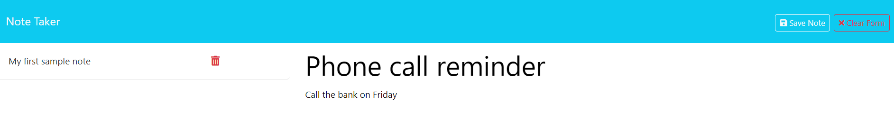

# Note-Taker

## Description
    
A note taking application that allows users to write and save notes to the database. User can also retrieve the notes and delete the notes. Users can use this web app to keep track of their thoughts and tasks.
    
## Table of Contents
    
- [Installation](#installation)
- [Usage](#usage)
- [Credits](#credits)
- [License](#license)
- [How to Contribute](#how-to-contribute)
- [Tests](#tests)
- [Questions](#questions)
    
## Installation
    
Open url link https://note-taker-app-05-11-23-736e39b907ab.herokuapp.com/ in a browser such as Google Chrome, Firefox or Edge etc.

## Usage

On the home page, click on Get started button and you will be taken to the notes list page. On the notes page, you can see existing notes listed on the left hand side of the screen and note details on right hand side.

To create a new note, simply type a note title and note content in the text fields and hit the Save icon button. The new note should appear on the notes list on the left handside of the page.

You can delete a note by click on the red bin icon next to the note Title on the notes list.
    
## Credits
Note ID generated by third party package [UUID](https://www.npmjs.com/package/uuid). 

## License
 
This project is licensed under the MIT License - see the [LICENSE.md](license) file for details    
 
## How to Contribute
    
Feel free to contribute your ideas or bug fixes for this project by raising a new issue or new pull request.
    
## Tests
NA
